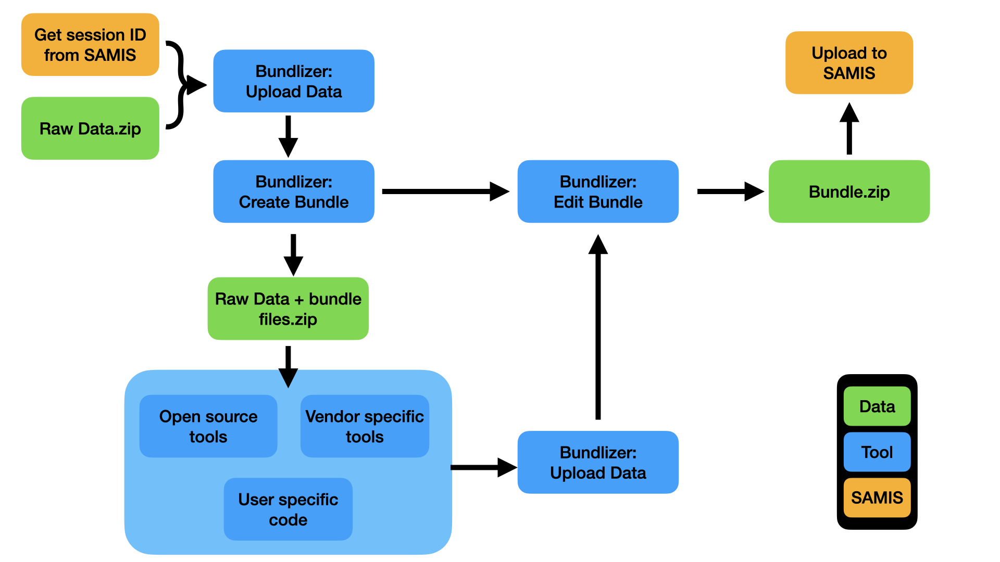

# Bundlizer
Interface for automatically generating SAMIS bundles out of media from scientific instruments.

This tool allows you to upload information from an experiment and produce a bundle file for submission to SAMIS.  Bundlizer will automatically generate standard data formats and yaml files for your experimental data, assuming there is a valid plugin for your instrument and bundle delivery document (BDD).  Once you have produced a bundle from your raw data, it can be uploaded directly to SAMIS.  Alternately, you can download the raw data plus bundle files for further editing and analysis.  The directory containing raw data plus bundle files can be re-uploaded and used to produce a final bundle file.  The following flow chart helps explain the flow:

(Todo youtube video showing how to use bundlizer.)